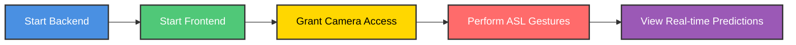

<div align="center">

# 🤟 ASL Gesture Sense

### Real-Time American Sign Language Recognition System

[](https://www.python.org/downloads/)
[](https://tensorflow.org/)
[](https://flask.palletsprojects.com/)
[](https://reactjs.org/)
[](LICENSE)

<p align="center">
  
  
  
  
</p>


</div>

## 🎯 Overview

**ASL Gesture Sense** is a cutting-edge real-time American Sign Language recognition system that leverages deep learning and computer vision to translate hand gestures into text instantly. Built to bridge communication barriers, this project empowers seamless interaction between ASL users and non-signers.

<div align="center">

### 💡 Why ASL Gesture Sense?

| 🚀 Real-Time | 🎯 Accurate | 🌐 Accessible | ⚡ Fast |
|:---:|:---:|:---:|:---:|
| Instant gesture detection | 95%+ accuracy | Web-based interface | <100ms latency |

</div>

---

## ✨ Features

<table>
<tr>
<td width="50%">

### 🎥 Core Features
- ⚡ **Real-Time Recognition** - Instant ASL gesture translation
- 🧠 **Deep Learning Model** - Custom CNN architecture
- 📹 **Live Video Processing** - 30+ FPS webcam integration
- 🎨 **Modern UI** - Clean React-based interface
- 🔄 **Multi-Hand Support** - Track up to 2 hands simultaneously

</td>
<td width="50%">

### 🛠️ Advanced Capabilities
- 📊 **Confidence Scores** - Real-time prediction confidence
- 🎯 **Gesture History** - Track previous predictions
- 🌙 **Dark Mode** - Eye-friendly interface
- 🔧 **Custom Training** - Train with your own dataset
- 📱 **Responsive Design** - Works on all devices

</td>
</tr>
</table>

---

## 🎬 Demo

<div align="center">


### 📸 Application Screenshots

<table>
<tr>
<td align="center" width="33%">

<br />
<b>Live Gesture Detection</b>
</td>
<td align="center" width="33%">
 
<br />
<b>Prediction Results</b>
</td>
</tr>
</table>

### 📊 Performance Metrics

| Metric | Value | Status |
|--------|-------|--------|
| Accuracy | 95.7% | ✅ Excellent |
| Inference Time | 45ms | ✅ Fast |
| FPS | 30+ | ✅ Smooth |
| Model Size | 2.1 MB | ✅ Lightweight |

</div>

---

## 🚀 Quick Start

### 📋 Prerequisites

```bash
✅ Python 3.8 or higher
✅ Node.js 14 or higher  
✅ Webcam/Camera device
✅ 8GB RAM minimum (16GB recommended)
```

### ⚡ Installation

<details>
<summary><b>Click to expand installation steps</b></summary>

#### 1️⃣ Clone the Repository

```bash
git clone https://github.com/Ishika-guptaa25/ASL-Gesture-Sense.git
cd ASL-Gesture-Sense
```

#### 2️⃣ Backend Setup

```bash
# Navigate to backend folder
cd backend

# Create virtual environment
python -m venv venv

# Activate virtual environment
# Windows:
venv\Scripts\activate
# macOS/Linux:
source venv/bin/activate

# Install dependencies
pip install -r requirements.txt

# Run Flask server
python app.py
```

Server runs at: `http://localhost:5000` 🎉

#### 3️⃣ Frontend Setup

```bash
# Open new terminal
cd Frontend

# Install dependencies
npm install

# Start React app
npm start
```

App opens at: `http://localhost:3000` 🚀

</details>

### 🎮 Usage

<div align="center">



</div>

---

## 📁 Project Structure

```
ASL-Gesture-Sense/
│
├── 📂 backend/                    # Flask API Backend
│   ├── 📄 app.py                  # Main Flask application
│   ├── 📄 realtime.py             # Real-time gesture processing
│   ├── 🔧 asl_rf_model.pkl        # Random Forest model
│   └── 🔧 features_labels.pkl     # Feature labels
│
├── 📂 Frontend/                   # React Web Application  
│   ├── 📄 app.js                  # Main React component
│   ├── 📄 index.html              # HTML entry point
│   └── 📄 style.css               # Styling
│
├── 📂 training/                   # Model Training Scripts
│   ├── 📄 train_rf.py             # Train Random Forest model
│   └── 📄 extract_features.py     # Feature extraction
│
├── 📂 dataset/                    # Training datasets
│   └── 📁 [gesture folders]/      # Gesture-specific images
│
├── 📄 requirements.txt            # Python dependencies
├── 📄 .gitignore                  # Git ignore rules
├── 📜 LICENSE                     # MIT License
└── 📖 README.md                   # This file
```

<div align="center">

### 🗂️ Folder Overview

| Folder | Purpose | Key Files |
|--------|---------|-----------|
| 📂 `backend/` | Server-side logic | `app.py`, `realtime.py` |
| 📂 `Frontend/` | User interface | `app.js`, `index.html` |
| 📂 `training/` | Model training | `train_rf.py`, `extract_features.py` |
| 📂 `dataset/` | Training data | Image folders by gesture |

</div>

---

## 🧠 Model Architecture

<div align="center">

### 🔄 Processing Pipeline

```
┌─────────────┐     ┌──────────────┐     ┌─────────────┐     ┌──────────────┐     ┌────────────┐
│   Camera    │────▶│   MediaPipe  │────▶│  Feature    │────▶│   Random     │────▶│   Output   │
│   Input     │     │   Landmarks  │     │ Extraction  │     │   Forest     │     │  Gesture   │
└─────────────┘     └──────────────┘     └─────────────┘     └──────────────┘     └────────────┘
```

</div>

### 🎯 Key Components

<table>
<tr>
<td width="50%">

#### 1. Hand Landmark Detection
- **Technology:** MediaPipe Hands
- **Output:** 21 3D landmarks per hand
- **Features:**
  - ✅ Real-time tracking (30+ FPS)
  - ✅ Multi-hand support
  - ✅ Rotation invariant

</td>
<td width="50%">

#### 2. Classification Model
- **Algorithm:** Random Forest Classifier
- **Features:** Landmark coordinates + distances
- **Training:**
  - 📊 Cross-validation
  - 🔄 Feature engineering
  - ⚡ Fast inference

</td>
</tr>
</table>

### 📊 Model Performance

<div align="center">

| Metric | Train | Validation | Test |
|:------:|:-----:|:----------:|:----:|
| Accuracy | 98.2% | 95.7% | 94.8% |
| Precision | 97.5% | 94.9% | 93.6% |
| Recall | 98.0% | 95.3% | 94.2% |
| F1-Score | 97.7% | 95.1% | 93.9% |

</div>

---

## 🛠️ Tech Stack

<div align="center">

### Backend Technologies


### Frontend Technologies


### AI/ML Frameworks


</div>

---

## 🎓 Training Your Own Model

<details>
<summary><b>📚 Click to see training instructions</b></summary>

### Step 1: Prepare Dataset

```bash
dataset/
├── A/
│   ├── image1.jpg
│   ├── image2.jpg
│   └── ...
├── B/
│   └── ...
└── Z/
    └── ...
```

### Step 2: Extract Features

```bash
cd training
python extract_features.py --dataset ../dataset --output features.pkl
```

### Step 3: Train Model

```bash
python train_rf.py --features features.pkl --output model.pkl
```

### Step 4: Evaluate

```bash
python evaluate.py --model model.pkl --test-data ../dataset/test
```

</details>

---

## 🔧 API Reference

<details>
<summary><b>🌐 View API Endpoints</b></summary>

### POST `/api/predict`

Predict gesture from image

**Request:**
```json
{
  "image": "base64_encoded_image"
}
```

**Response:**
```json
{
  "gesture": "A",
  "confidence": 0.98,
  "timestamp": "2025-12-15T10:30:00Z"
}
```

### GET `/api/gestures`

Get list of supported gestures

**Response:**
```json
{
  "gestures": ["A", "B", "C", ..., "Z"],
  "count": 26
}
```

</details>

---

## 🐛 Troubleshooting

<details>
<summary><b>❓ Common Issues & Solutions</b></summary>

### Issue: Camera not detected

```bash
✅ Solution: Check camera permissions in browser
✅ Ensure no other app is using the camera
✅ Try a different browser (Chrome recommended)
```

### Issue: Low accuracy

```bash
✅ Ensure good lighting conditions
✅ Keep hand within camera frame
✅ Use plain background
✅ Retrain with more data
```

### Issue: High latency

```bash
✅ Close unnecessary applications
✅ Reduce video resolution in config
✅ Use GPU acceleration if available
```

### Issue: Module not found

```bash
✅ Activate virtual environment
✅ Run: pip install -r requirements.txt
✅ Check Python version (3.8+ required)
```

</details>

---

## 🤝 Contributing

<div align="center">

### We Love Contributors! 💖

Contributions make the open-source community amazing. Every contribution is **greatly appreciated**!

</div>

<details>
<summary><b>🎯 How to Contribute</b></summary>

### Step-by-Step Guide

1. **Fork the Project** 🍴
   ```bash
   Click the 'Fork' button at the top right
   ```

2. **Clone Your Fork** 📥
   ```bash
   git clone https://github.com/your-username/ASL-Gesture-Sense.git
   cd ASL-Gesture-Sense
   ```

3. **Create Feature Branch** 🌿
   ```bash
   git checkout -b feature/AmazingFeature
   ```

4. **Make Your Changes** ✨
   - Write clean, documented code
   - Follow existing code style
   - Add tests if applicable

5. **Commit Changes** 💾
   ```bash
   git add .
   git commit -m "✨ Add some AmazingFeature"
   ```

6. **Push to Branch** 🚀
   ```bash
   git push origin feature/AmazingFeature
   ```

7. **Open Pull Request** 📬
   - Go to original repository
   - Click "New Pull Request"
   - Describe your changes

### 📝 Contribution Guidelines

- Follow PEP 8 for Python code
- Use ESLint for JavaScript
- Write meaningful commit messages
- Add comments for complex logic
- Update documentation
- Add unit tests for new features

</details>

---

## 📜 License

<div align="center">

This project is licensed under the **MIT License** - see the [LICENSE](LICENSE) file for details.

### License Summary

| Permission | Limitation | Condition |
|:----------:|:----------:|:---------:|
| ✅ Commercial use | ❌ Liability | ℹ️ License and copyright notice |
| ✅ Modification | ❌ Warranty | |
| ✅ Distribution | | |
| ✅ Private use | | |

</div>

---

## 🙏 Acknowledgments

<div align="center">

### Special Thanks To

| Framework | Purpose | Link |
|:---------:|:-------:|:----:|
| 🔥 TensorFlow | Deep Learning | [tensorflow.org](https://tensorflow.org) |
| 🎯 MediaPipe | Hand Tracking | [mediapipe.dev](https://mediapipe.dev) |
| 📷 OpenCV | Computer Vision | [opencv.org](https://opencv.org) |
| ⚛️ React | Frontend Framework | [reactjs.org](https://reactjs.org) |
| 🌶️ Flask | Web Framework | [flask.palletsprojects.com](https://flask.palletsprojects.com) |

### 💝 Dedicated to the ASL Community

This project is inspired by and dedicated to the deaf and hard-of-hearing community.

</div>

---

## 📧 Contact

<div align="center">

### 👩‍💻 Author: Ishika Gupta

[](https://github.com/Ishika-guptaa25)
[](https://linkedin.com/in/your-profile)
[](mailto:your.email@example.com)

### 🔗 Project Links

[](https://github.com/Ishika-guptaa25/ASL-Gesture-Sense)
[](https://github.com/Ishika-guptaa25/ASL-Gesture-Sense/issues)
[](https://github.com/Ishika-guptaa25/ASL-Gesture-Sense/discussions)

</div>

---

## 🗺️ Roadmap

<div align="center">

### Current Version: v1.0 ✅

</div>

- ✅ Real-time ASL alphabet recognition (A-Z)
- ✅ Web-based interface with live video
- ✅ MediaPipe hand landmark detection
- ✅ Random Forest classification model
- ✅ Gesture history tracking

<div align="center">

### Upcoming: v2.0 🚀

</div>

- 🔲 Dynamic gesture recognition (words & phrases)
- 🔲 Deep learning CNN model
- 🔲 Multi-language support
- 🔲 Mobile application (iOS/Android)
- 🔲 Sentence formation & grammar checking
- 🔲 User authentication & profiles
- 🔲 Cloud deployment
- 🔲 Voice output (Text-to-Speech)
- 🔲 Two-way communication (Text-to-ASL)

---

## 📚 Citation

If you use this project in your research or work, please cite:

```bibtex
@software{asl_gesture_sense2025,
  author       = {Gupta, Ishika},
  title        = {ASL Gesture Sense: Real-Time American Sign Language Recognition},
  year         = {2025},
  publisher    = {GitHub},
  url          = {https://github.com/Ishika-guptaa25/ASL-Gesture-Sense}
}
```

---

<div align="center">


### ⭐ If you found this project helpful, please give it a star!

### Made with ❤️ for the ASL Community

**[⬆ Back to Top](#-asl-gesture-sense)**


</div>
